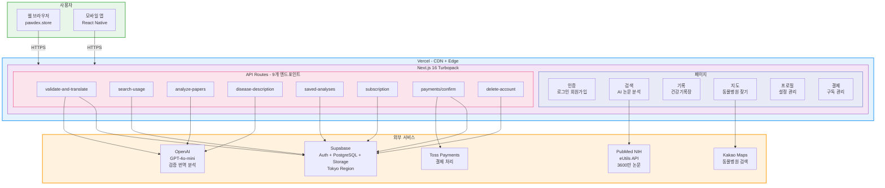
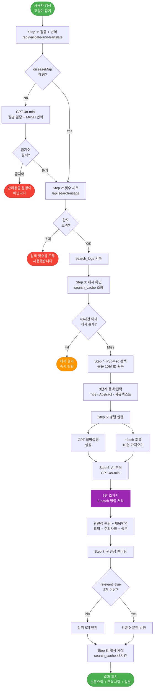
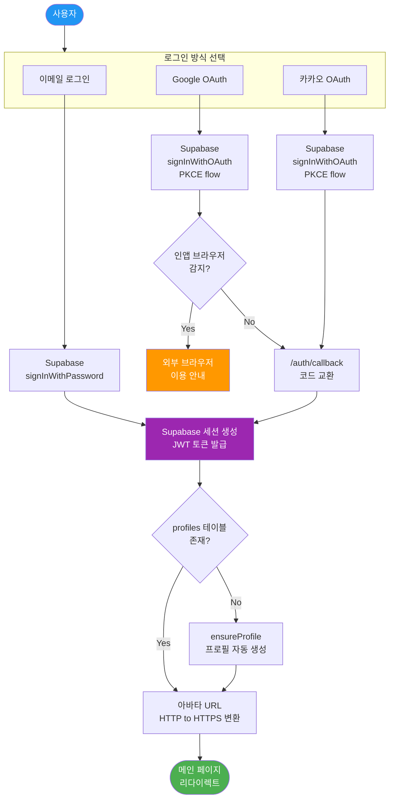
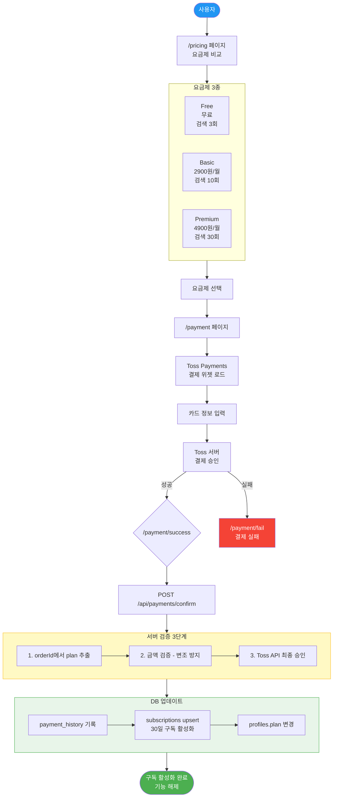
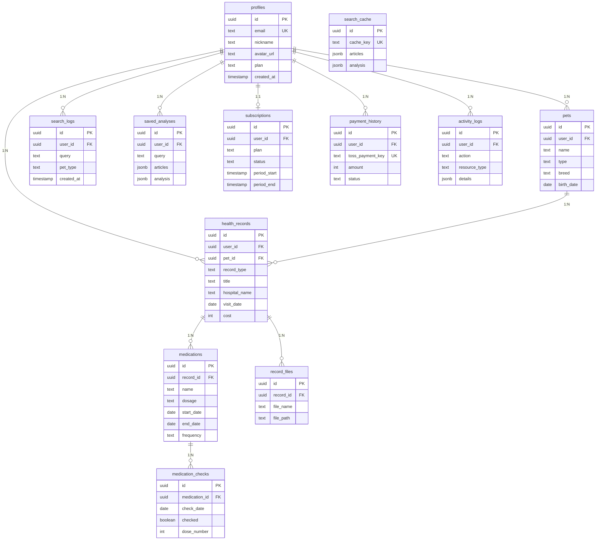
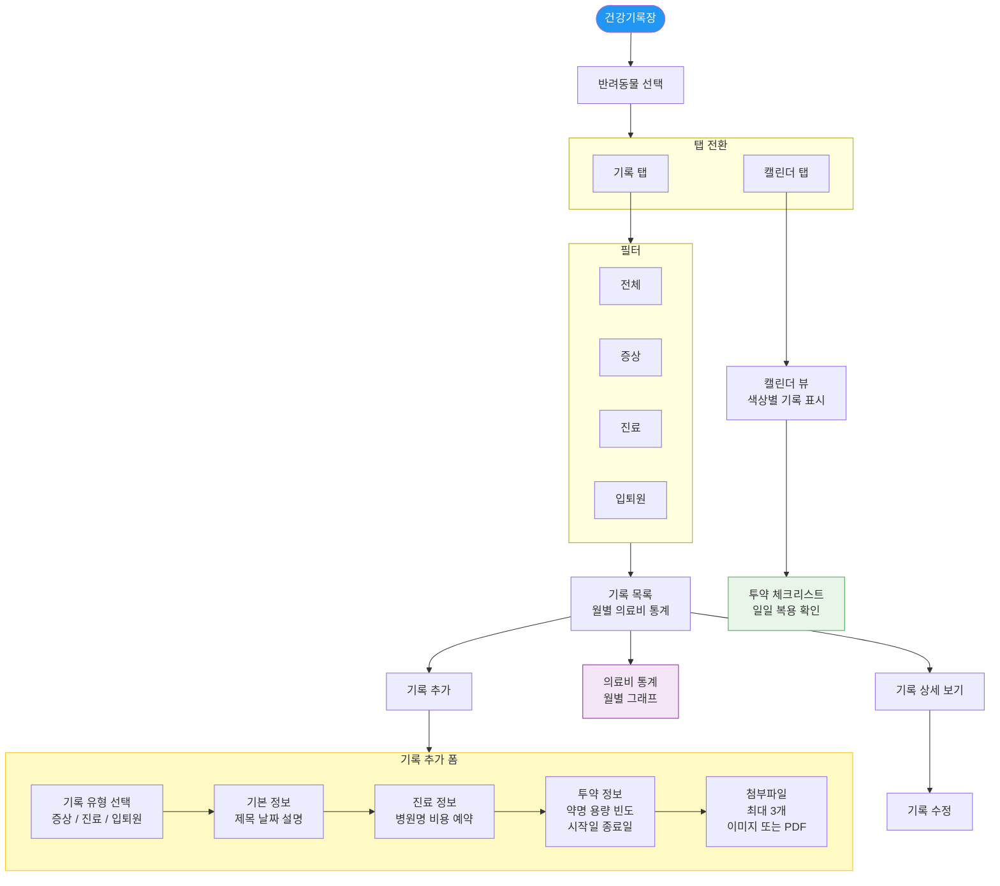

# PawDex PPT 다이어그램 - Mermaid 코드

> 사용법: 각 코드 블록을 https://mermaid.live 에 붙여넣기 → PNG/SVG 다운로드

---

## 1. 시스템 구조도 (전체 아키텍처)

---

## 2. AI 논문 검색 파이프라인 (핵심 기능)

---

## 3. 인증 흐름

---

## 4. 결제 흐름

---

## 5. DB 스키마 (ER 다이어그램)

---

## 6. 요금제 비교

```mermaid
graph LR
    subgraph FREE["Free - 무료"]
        F1["검색 3회/일"]
        F2["기록 5개"]
        F3["AI분석 흐림처리"]
        F4["보관 불가"]
        F5["반려동물 1마리"]
    end

    subgraph BASIC["Basic - 2900원/월"]
        B1["검색 10회/일"]
        B2["기록 15개"]
        B3["AI분석 전체 공개"]
        B4["보관 10개"]
        B5["반려동물 3마리"]
    end

    subgraph PREMIUM["Premium - 4900원/월"]
        P1["검색 30회/일"]
        P2["기록 무제한"]
        P3["AI분석 전체 공개"]
        P4["보관 무제한"]
        P5["반려동물 무제한"]
    end

    FREE -.->|업그레이드| BASIC
    BASIC -.->|업그레이드| PREMIUM

    style FREE fill:#E8F5E9,stroke:#4CAF50,stroke-width:2px
    style BASIC fill:#E3F2FD,stroke:#2196F3,stroke-width:2px
    style PREMIUM fill:#FFF3E0,stroke:#FF9800,stroke-width:2px
```

---

## 7. 건강기록 관리 흐름

---

## 사용법

1. https://mermaid.live 접속
2. 왼쪽 에디터에 코드 블록 내용 붙여넣기 (백틱mermaid 와 백틱 제외)
3. 오른쪽 미리보기 확인
4. 상단 메뉴 Actions - PNG 또는 SVG 다운로드
5. PPT에 이미지 삽입

### 팁
- 배경 투명: Actions - PNG transparent 선택
- 크기 조절: 다운로드 후 PPT에서 자유롭게 리사이즈
- 테마 변경: Config 탭에서 theme를 dark 또는 forest 등으로 변경 가능
